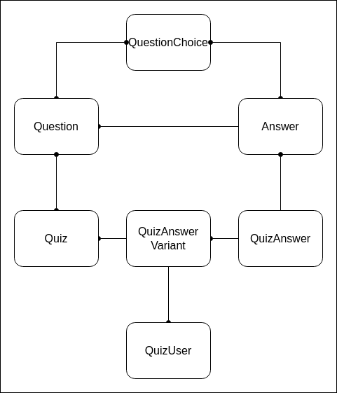
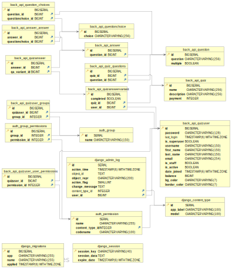

# Check list
 - [x] Регистрация и авторизация пользователея (`/auth/register` и `/auth/login`)
 - [x] Вывод списка доступных опросов (`/quizzes/`)
 - [x] Вывод списка пользователей и пройденных ими опросов (`/leaderboard/`)
 - [x] Заполнение опроса (`/quiz/<int:id>`)
 - [x] Страница пользователя с возможностью изменить цвета профиля (`/profile`)
 - [ ] Фронт на React
 - [ ] Тесты  
 - [x] Стандартный суперпользователь (`username=admin; password=admin`)  

# Схема БД
### ER-диаграмма

Причина выбора данного типа БД: возможность масштабирования шаблонов вопроса-ответа (добавления текстового ответа, загрузка файла и т.д.)

### KB-диаграмма

